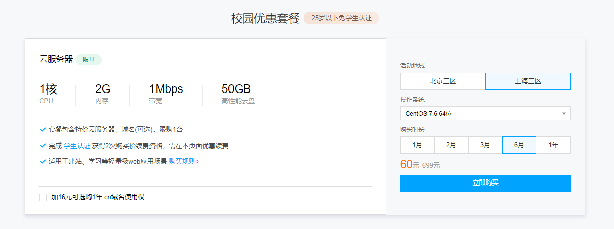
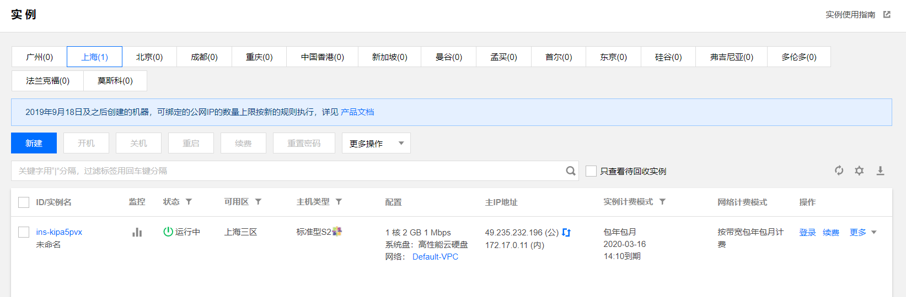

# 实验一

1. 购买腾讯云服务器（学生）并登录（webshell和xshell）

2. 创建GitHub项目并在本地同步

3. 本地安装VMware Workstation和CentOS操作系统

   ## 购买腾讯并配置xshell

   点击腾讯云服务器链接进入购买界面，注意选择**活动地域**和**操作系统**

   [腾讯云购买链接](https://cloud.tencent.com/act/campus?fromSource=gwzcw.2432687.2432687.2432687&utm_medium=cpc&utm_id=gwzcw.2432687.2432687.2432687)

   购买完毕进入登录界面

点击登陆，这里提供两种登录方式（这里我选择密钥登陆）