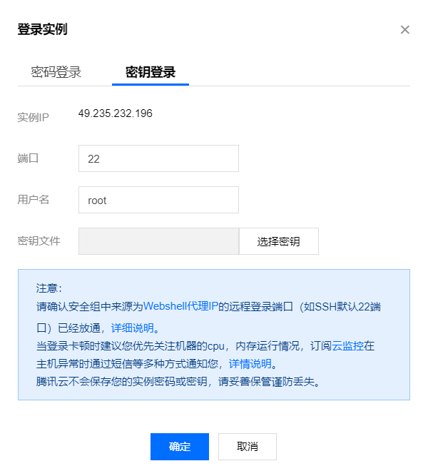
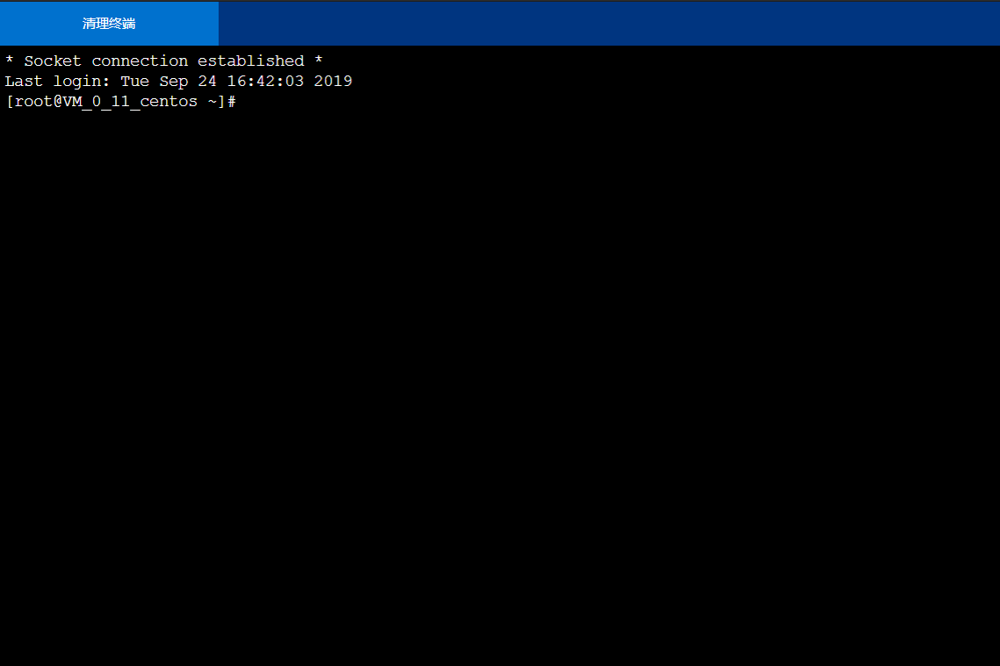
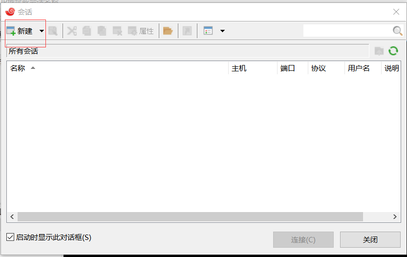
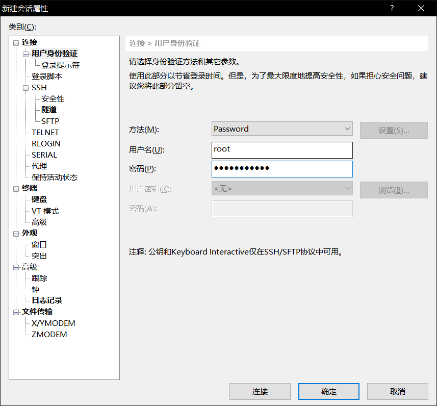
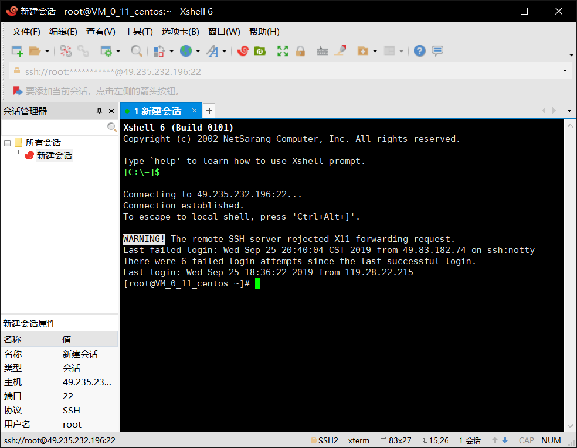
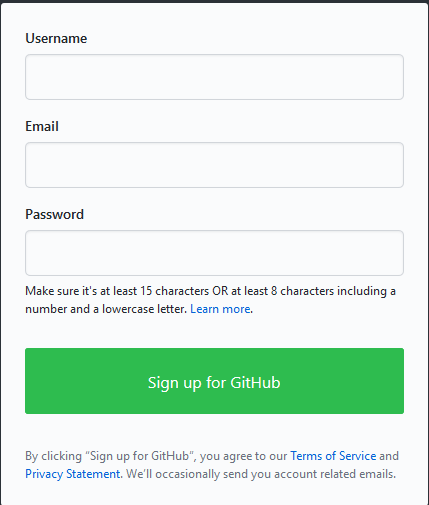
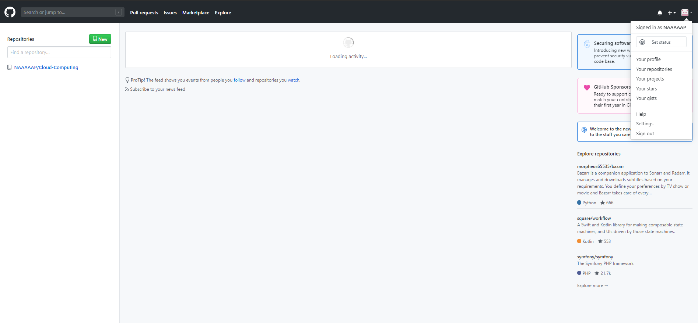

#                                 **实验一**

## **购买腾讯并配置xshell**

点击腾讯云服务器链接进入购买界面，注意选择**活动地域**和**操作系统**

[腾讯云服务器购买链接](https://cloud.tencent.com/act/campus?fromSource=gwzcw.2432687.2432687.2432687&utm_medium=cpc&utm_id=gwzcw.2432687.2432687.2432687)

购买完毕进入登录界面

 点击登陆，这里提供两种登录方式（这里我选择密钥登陆）

登录成功显示如下

xshell下载地址： [xshell官方](https://xshell.en.softonic.com/)

下载安装

配置xshell，点击新建对话

用户名处填写公网ip，登录名若没有改则填写root，密码填写腾讯云服务器密码

点击连接，若成功显示如下

## **创建GitHub项目并在本地同步**

点击[github](https://github.com)，注册账号

登录账号，点击账户头像，点击your repositories,进入项目界面

点击new，创建新项目

写项目名称，描述（这里项目我取名Cloud-Computing）

