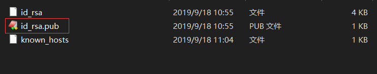

#                                 **实验一**

## **购买腾讯并配置xshell**

点击腾讯云服务器链接进入购买界面，注意选择**活动地域**和**操作系统**

[腾讯云服务器购买链接](https://cloud.tencent.com/act/campus?fromSource=gwzcw.2432687.2432687.2432687&utm_medium=cpc&utm_id=gwzcw.2432687.2432687.2432687)


购买完毕进入登录界面


 点击登陆，这里提供两种登录方式（这里我选择密钥登陆）


登录成功显示如下


xshell下载地址： [xshell官方](https://xshell.en.softonic.com/)

下载安装

配置xshell，点击新建对话


用户名处填写公网ip，登录名若没有改则填写root，密码填写腾讯云服务器密码


点击连接，若成功显示如下


## **创建GitHub项目并在本地同步**

点击[github](https://github.com)，注册账号


登录账号，点击账户头像，点击your repositories,进入项目界面


点击new，创建新项目


写项目名称，描述（这里项目我取名Cloud-Computing）


点击创建，就ok了

本地同步

下载**git**→ [Git官网](https://git-scm.com/downloads)

安装完成打开git bash


输入以下代码生成**.ssh**

```
$ ssh-keygen-t rsa-C "github邮箱"
```

直接回车不用管

找到创建在本地的.ssh中的密钥**id_rsa**



查看并复制其中的密钥，点击github头像中的settings


点击SSH and GPG keys，并创建New SSH keys


title随便取，将刚刚复制的密钥粘贴到Key中，并点击添加


在git bash中输入以下命令同步下名字和邮箱

```
git config --global usr.name"输入名字（修改）"

git config --global usr.email"输入邮箱（修改）"
```

接下来在本地创建文件夹作为仓库，在git bash中cd进入仓库，输入

```
git init
```

输入完，进入个人主页，点击头像中的**Your repositories**复制刚刚创建项目点的链接


在git bash输入

```
git remote add origin `拷贝的项目链接`
```

在本地创建一个test.txt文件

git bash中输入

```
git add test.txt
```

（双引号内为备注）

```
git commit -m "cloudcomputing"
git push origin master
```

就会发现文件已经上传到个人主页上了


## 本地安装VMware Workstation和CentOS操作系统

安装VMware Workstation

[下载链接](https://my.vmware.com/cn/web/vmware/free#desktop_end_user_computing/vmware_workstation_player/15_0)

安装时一直next就完事咯

下载CentOS

[官网链接](https://www.centos.org/download/)

安装方式和VM一样next就好

