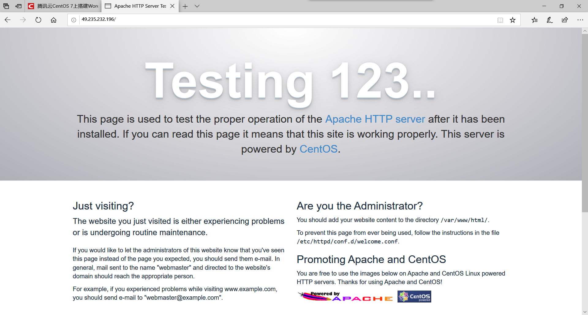

# **实验二**

## **1.安装Apache Web服务器**

使用yum工具安装：

启动Apache Web服务器：

测试Apache服务器是否成功运行，在浏览器输入：

http://[http://49.235.232.196](http://49.235.232.196/)/

若运行正常，将出现如下界面：

## **2.安装MYSQL**

安装MariaDB:

安装好之后，启动mariadb:

运行简单的安全脚本以移除潜在的安全风险，启动交互脚本：

设置相应的root访问密码以及相关的设置

最后设置开机启动MariaDB:

## **3.安装PHP**

首先启动这两个仓库

接着启用PHP 7.2 Remi仓库：

安装PHP以及php-mysql

查看安装的php版本：

安装之后，重启Apache服务器以支持PHP:

安装PHP模块

如下命令可以查看可用模块：

部分结果如图所示：

这里先行安装php-fpm(PHP FastCGI Process Manager)和php-gd(A module for PHP applications for using the gd graphics library)，WordPress使用php-gd进行图片的缩放。

## **4.测试PHP**

这里我们利用一个简单的信息显示页面（info.php）测试PHP。创建info.php并将其置于Web服务的根目录

该命令使用vim在/var/www/html/处创建一个空白文件info.php，我们添加如下内容：

完成之后，使用刚才获取的cvm的IP地址，在本地主机的浏览器中输入:

http://49.235.232.196/info.php

即可看到如下界面：

## **5.安装WordPress以及完成相关配置**

### **1）为WordPress创建一个MySQL数据库**

 首先以root用户登录MySQL数据库：

 键入之前设置的root用户密码，并按下回车键进入MySQL命令行模式。

首先为WordPress创建一个新的数据库：

CREATE DATABASE wordpress;

接着为WordPress创建一个独立的MySQL用户：

CREATE USER admin@localhost IDENTIFIED BY '123456';

授权给wordpressuser用户访问数据库的权限：

授权给wordpressuser用户访问数据库的权限：

GRANT ALL PRIVILEGES ON wordpress.* TO admin@localhost IDENTIFIED BY '123456';

随后刷新MySQL的权限：

FLUSH PRIVILEGES;

最后，退出MySQL的命令行模式：

### **2）安装WordPress**

下载WordPress至当前用户的主目录：

wget命令从WordPress官方网站下载最新的WordPress集成压缩包，解压该文件：

解压之后在主目录下产生一个wordpress文件夹。我们将该文件夹下的内容同步到Apache服务器的根目录下，使得wordpress的内容能够被访问。这里使用rsync命令：

接着在Apache服务器目录下为wordpress创建一个文件夹来保存上传的文件：

对Apache服务器的目录以及wordpress相关文件夹设置访问权限：

这样Apache Web服务器能够创建、更改WordPress相关文件，同时我们也能够上传文件。

###  **3）配置WordPress**

大多数的WordPress配置可以通过其Web页面完成，但首先通过命令行连接WordPress和MySQL。 定位到wordpress所在文件夹：

WordPress的配置依赖于wp-config.php文件，当前该文件夹下并没有该文件，我们通过拷贝wp-config-sample.php文件来生成：

然后，通过nano超简单文本编辑器来修改配置，主要是MySQL相关配置：

将文件中的DB_NAME，DB_USER和DB_PASSWORD更改成之前为WordPress创建的数据库的相关信息，这三处信息是当前唯一需要修改的。

### **4）通过Web界面进一步配置WordPress**

经过上述的安装和配置，WordPress运行的相关组件已经就绪，接下来通过WordPress提供的Web页面进一步配置。输入你的IP地址或者域名：

http://49.235.232.196/

出现如下界面：

设置网站的标题，用户名和密码以及电子邮件等，点击**Install WordPress**

点击**Log In**，弹出登录界面：

输入用户名和密码之后，进入WordPress的控制面板：

