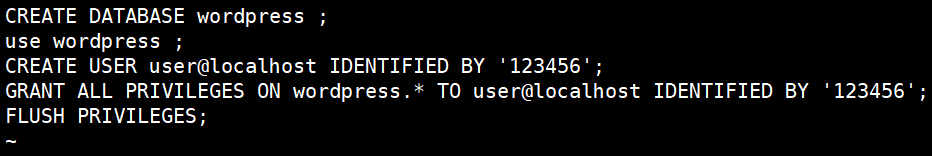
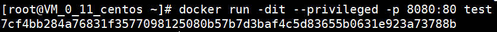

# **实验三** 

## **(一) Centos 7安装Docker**

首先更新应用程序数据库

```
sudo yum check-update
```


添加Docker官方仓库，安装最新Docker

```
curl -fsSL http://get.docker.com/ |sh
```


启动Docker

```
sudo systemctl start docker
```


设置Docker自启动

```
sudo systemctl enable docker
```


查看Docker版本信息

```
docker version
```


##  **(二) Docker加载Centos镜像**

拉取Centos 7

```
docker pull centos:7
```


拉取完毕查看镜像

```
docker images
```


运行Docker容器（为了方便检测后续wordpress搭建是否成功，需设置端口映射（-p），将容器端口80 映射到主机端口8888，Apache和MySQL需要 systemctl 管理服务启动，需要加上参数 --privileged 来增加权，并且不能使用默认的bash，换成 init，否则会提示 Failed to get D-Bus connection: Operation not permitted ，，-name 容器名 ，命令如下 ）

```
docker run -d -it --privileged --name wordpress -p 8888:80 -d centos:7 /usr/sbin/init
```


查看已启动的容器

```
docker ps
```


进入容器前台（容器id可以缩写为前几位：a14）

```
docker exec -it a14 /bin/bash
```


容器中安装workpress

详细操作参照实验二[Centos安装wordpress](https://github.com/NAAAAAP/Cloud-Computing/tree/master/work2)

安装完毕通过浏览器访问 服务器:8888 查看


4.推送带有wordpress的镜像

前往DockerHub网站(https://hub.docker.com/)注册账号

返回容器前段，将容器生成镜像(所生成的镜像名由 "Docker用户名/Docker仓库名组成" ，否则推送会报错： denied: requested access to the resource is denied )

```
docker commit -a "Docker用户名" -m "提交描述" 容器id 镜像名:tag标签
# 举例 docker commit -a "naaaaap" -m "wordpress on centos7" a14f13398cc8 naaaaap/centos:v1
```


登入Docker

```
docker login
```


推送镜像

```
docker push 镜像名:tag标签
# 举例  docker push naaaaap/centos:v1
```


若docker账号中出现推送镜像即为成功 ！


## **(三) 利用Dockerfile文件创建wordpress的镜像**

编写Dockerfile文件


创建file文件夹，在下面编写dockerfile所需文件 :

编写start.sh


编写install.sh


编写start.service


编写mysql.sql（需对其进行修改）



构建镜像

```
docker build -t test .
docker images
```


运行并设置端口映射

```
docker run -dit --privileged -p 8080:80 test
```



```
docker ps
```


进入容器

```
docker exec -it 7c /bin/bash
```


浏览器中输入49.235.232.196:8080查看


完成！！！