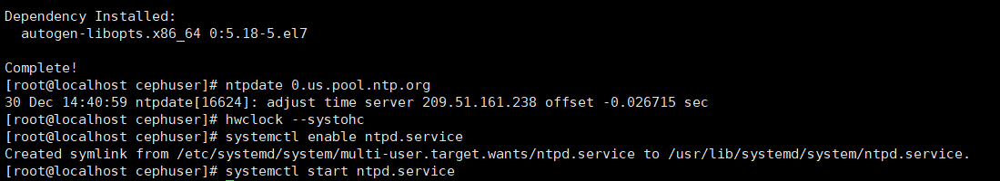
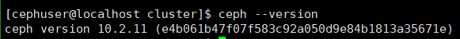

# **Ceph的安装与实践**

### **1.配置所有节点**

**安装centos时选择最小版**


**为用户添加sudo权限**


```
echo "cephuser ALL = (root) NOPASSWD:ALL" | sudo tee /etc/sudoers.d/cephuser

chmod 0440 /etc/sudoers.d/cephuser

sed -i s'/Defaults requiretty/#Defaults requiretty'/g /etc/sudoers
```

**安装配置ntp服务**

```
yum install -y ntp ntpdate ntp-doc

ntpdate 0.us.pool.ntp.org

hwclock --systohc

systemctl enable ntpd.service

systemctl start ntpd.service
```



**禁用SELINUX**

```
sed -i 's/SELINUX=enforcing/SELINUX=disabled/g' /etc/selinux/config
```

**添加ceph仓库：**

```
sudo vi /etc/yum.repos.d/ceph.repo
```

**文件内容**

```
[ceph]

name=Ceph packages for $basearch

baseurl=http://mirrors.163.com/ceph/rpm-jewel/el7/$basearch

enabled=1

gpgcheck=0

priority=1

type=rpm-md

gpgkey=http://mirrors.163.com/ceph/keys/release.asc


[ceph-noarch]

name=Ceph noarch packages

baseurl=http://mirrors.163.com/ceph/rpm-jewel/el7/noarch

enabled=1

gpgcheck=0

priority=1

type=rpm-md

gpgkey=http://mirrors.163.com/ceph/keys/release.asc

 
[ceph-source]

name=Ceph source packages

baseurl=http://mirrors.163.com/ceph/rpm-jewel/el7/SRPMS

enabled=0

gpgcheck=0

type=rpm-md

gpgkey=http://mirrors.163.com/ceph/keys/release.asc

priority=1
```

**防火墙设置**

开启

```
systemctl start firewalld
```

自启

```
systemctl enable firewalld
```


要所有节点在虚拟机上运行

```
yum install -y open-vm-tools
```

**完成基本配置，克隆虚拟机！！**


**三台机器ip地址**

**ceph -admin**

IP：192.168.76.128

**mon1**

IP：192.168.76.129

**osd1**

IP：192.168.76.130

**osd2**

IP：192.168.76.131

**ceph-admin节点防火墙**

```
sudo firewall-cmd --zone=public --add-port=80/tcp --permanent

sudo firewall-cmd --zone=public --add-port=2003/tcp --permanent

sudo firewall-cmd --zone=public --add-port=4505-4506/tcp --permanent

sudo firewall-cmd --reload
```


**mon1节点防火墙**

```
sudo firewall-cmd --zone=public --add-port=6789/tcp --permanent

sudo firewall-cmd --reload
```


**osd点防火墙**

```
sudo firewall-cmd --zone=public --add-port=6800-7300/tcp --permanent

sudo firewall-cmd --reload  
```


### **2. 配置SSH服务器**

**ecph-admin节点**

```
vi /etc/hosts
```


**设置免密登录ssh**

```
su - cephuser
```

**生成密钥**

```
ssh-keygen
```


```
vi ~/.ssh/config
```

添加内容如下：


**更改配置文件的权限**

```
chmod 644 ~/.ssh/config

ssh-keyscan osd1 osd2 mon1 >> ~/.ssh/known_hosts
```


使用ssh-copy-id命令将SSH密钥添加到所有节点。

```
ssh-copy-id ceph-admin

ssh-copy-id mon1

ssh-copy-id osd1

ssh-copy-id osd2
```

**测试连接各节点ssh**


### **3. ceph-deploy安装**

```
sudo yum update && sudo yum install ceph-deploy
```


### **4. 创建集群**

```
mkdir cluster && cd cluster

ceph-deploy new mon1

vi ceph.conf
```

添加文件内容:


### **5. 在所有节点上安装Ceph**

```
ceph-deploy install ceph-admin mon1 osd1 osd2
```

**查看ceph version**



**mon1节点执行**

```
hostnamectl set-hostname mon1
```

修改主机名为mon1

**ecph-admin节点**

```
ceph-deploy mon create-initial

ceph-deploy gatherkeys mon1
```


**为osd守护进程创建目录**

**osd节点：**

```
sudo mkdir /var/local/osd

sudo chown ceph: /var/local/osd
```

**ecph-admin节点**

将管理密钥部署到所有关联的节点。

```
准备所有OSDS节点
ceph-deploy osd prepare osd1:/var/local/osd osd2:/var/local/osd

激活OSD
ceph-deploy osd activate osd1:/var/local/osd osd2:/var/local/osd

将管理密钥部署到所有关联的节点。
ceph-deploy admin ceph-admin mon1 osd1 osd2
```


通过在所有节点上运行以下命令来更改密钥文件的权限

```
sudo chmod 644 /etc/ceph/ceph.client.admin.keyring
```

### **6.检查集群状态**

**登录mon1管理节点，查看health状态**

```
ssh mon1

sudo ceph health

sudo ceph -s
```

